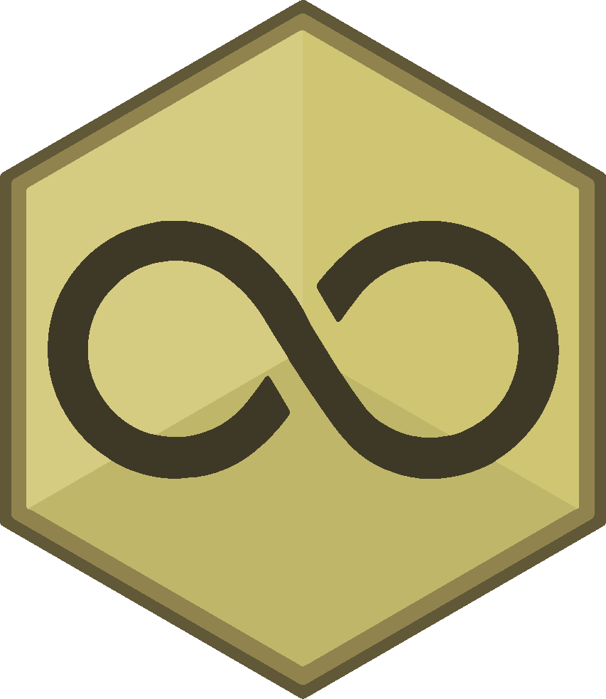

<h1 align="center">
  <br>
  
  <br>
  BACKROOMS ONLINE
</h1>

<p align="center">
  <i>You shouldn't be here.</i>
  <br><br>
  <a href="https://mcookinho.github.io/Backrooms-Online/">▶ Play now</a>
</p>

<p align="center">
  
  
  
</p>

---

## About

**Backrooms Online** is a first-person exploration horror game set in the **Backrooms** — an endless maze of yellow corridors, empty offices, and a constant fluorescent hum. Inspired by the original creepypasta and 90s VHS aesthetics.

You wake up in a monotonous office level. No memory. No obvious exit. Just the buzzing of the lights and the feeling that something is wrong.

## Features

- **Procedural world** — 160×120 tiles (640m × 480m) with 40 procedurally generated zones: rooms, corridors, open halls, mazes, raised areas, and pits.
- **Dynamic height** — Tiles with varying elevation, sloped ramps, and walls that adapt to the terrain. Nothing is flat.
- **Flashlight** — Find a flashlight to light the darkness. Extra batteries scattered around the map.
- **Inventory system** — Collect items: Almond Water (healing), Batteries, Medkit, Lighter, Notes, and Keys.
- **Threats** — Entities patrol the level. Some are fast. Others are relentless.
- **Analog HUD** — VHS-style interface: health and stamina bars, crosshair, and interaction prompts.
- **Immersive audio** — Real CC0 sounds: fluorescent hum, carpet footsteps, flashlight click.
- **Controls** — WASD to move, Shift to run, Space to jump, E to interact, F for flashlight, I for inventory. Mobile support with virtual joystick.

## Items

| Item | Effect |
|------|--------|
| Almond Water | Restores 25 HP |
| Medkit | Restores 50 HP |
| Flashlight | Illuminates dark areas |
| Batteries | Recharges the flashlight |
| Lighter | Temporarily lights the area |
| Note | Lore fragments |
| Key | Opens locked doors |

## Controls

| Key | Action |
|-----|--------|
| WASD | Move |
| Shift | Run |
| Space | Jump |
| E | Interact |
| F | Toggle flashlight |
| I | Open inventory |
| C | Crouch |

## Tech Stack

- **[Three.js](https://threejs.org/)** — WebGL 3D rendering
- **[Vite](https://vitejs.dev/)** — Build tool and dev server
- **[gh-pages](https://github.com/tschaub/gh-pages)** — Deploy automation
- **[Freesound.org](https://freesound.org/)** — CC0 sound effects

## Development

```bash
# Install dependencies
npm install

# Start dev server
npm run dev

# Production build
npm run build

# Deploy to GitHub Pages
npm run deploy
```

## License

MIT

---

<p align="center">
  <i>"If you hear a hum, don't follow it."</i>
</p>
